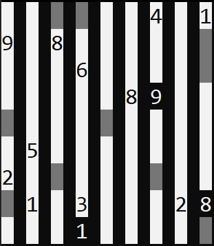
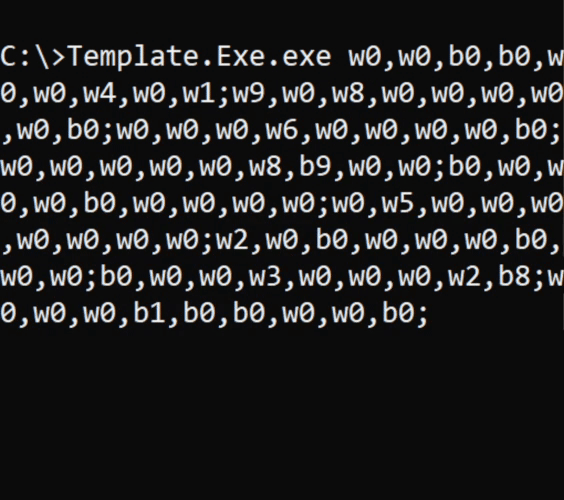

# Str8ts-Solver
`Str8ts-Solver` is a program that solves any given str8ts puzzle (via backtracking) according to its rules and will not terminate until all solutions are found. The current progress will be displayed in the console and once it has terminated you can scroll through all solutions via the arrow keys.

## Rules
Rows and columns are divided into compartments of white squares. Look at the diagram on the right which has two 'straights' filled in and highlighted. The black cells separate the compartments. Compartments can be both vertical and horizontal.

Squares in compartments need to be filled in with single numbers. These must complete a 'straight'. A straight is a set of numbers with no gaps and in any order, such as [6,8,7] or [3,2,4,5], as shown on the diagram.

No single number can repeat in any row or column - same rule as Sudoku.

Clues in black cells remove that number as an option in that row and column, and are not part of any straight. 

## Input Arguments
The input for the 2-dimensional str8ts puzzle is in a string format. Each cell is described by a color (b/w for black or white) and number. The cells in a row are separated by either a "." or "," and the columns are separated by a ";" or "|".
 Example for a row:
 "w0,w0,b0,b0,w0,w0,w4,w0,w1;" => this would translate to a row "0 0 <a style="color:white; background-color:black">0 0 <a>0 0 4 0 1"

Multiple rows concatenated build up the 2d matrix.
 Example for entire str8ts puzzle:

w0,w0,b0,b0,w0,w0,w4,w0,w1;
 w9,w0,w8,w0,w0,w0,w0,w0,b0;
 w0,w0,w0,w6,w0,w0,w0,w0,b0;
 w0,w0,w0,w0,w0,w8,b9,w0,w0;
 b0,w0,w0,w0,b0,w0,w0,w0,w0;
 w0,w5,w0,w0,w0,w0,w0,w0,w0;
 w2,w0,b0,w0,w0,w0,b0,w0,w0;
 b0,w1,w0,w3,w0,w0,w0,w2,b8;
 w0,w0,w0,b1,w0,w0,w0,w0,b0;

This will be translated as:
 

## Demonstration

